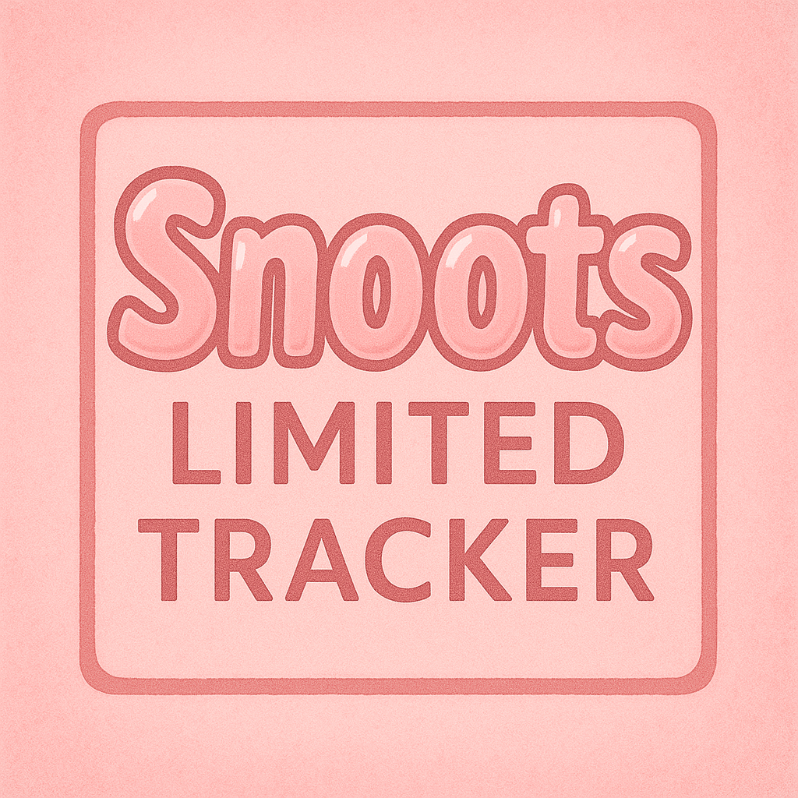
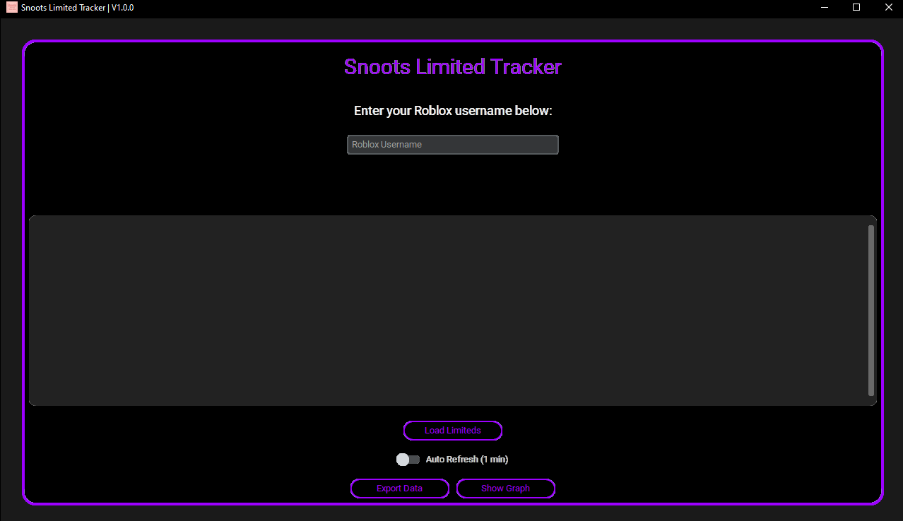
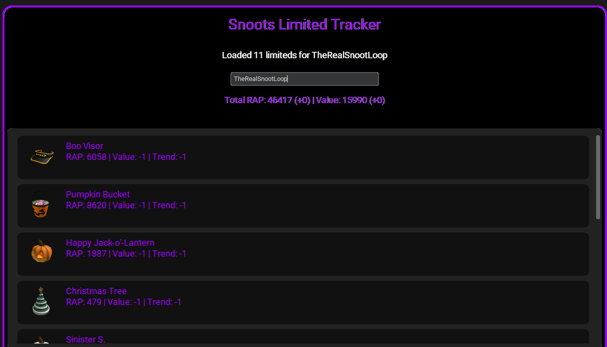

<p align="center">
  
</p>

# 🎯 Snoots Limited Tracker

Snoots Limited Tracker is a lightweight, modern tracker designed for collectors and fans of limited-time items. Whether you're following time-sensitive drops, seasonal exclusives, or event-based collectibles, this application helps you stay organized, informed, and in control.

---

## 🚀 Features

- ✅ Real-time limited item tracking  
- 📊 Stats overview with filters and breakdowns  
- 🖼️ Integrated image previews of items  
- 📝 Save, load, and manage your collection sessions  
- ⚙️ Customizable UI with simple and intuitive design  
- 🧩 Modular architecture for future plugin support  

---

## 💾 Installation

>  **Note:** Before running the app, make sure to **unzip the `images.zip` file** into the root project folder. This is required for image previews to load properly.

### Windows

1. **Install Python 3.10 or later**  
   [Download Python for Windows](https://www.python.org/downloads/windows/)

2. **Download or clone this repository**
   ```cmd
   git clone https://github.com/KetaGod/SnootsLimitedTracker.git
   ```

3. **Unzip `images.zip`**  
   Right-click on `images.zip` → Extract All → Ensure the `images/` folder appears in your root directory.

4. **Install dependencies**
   Open Command Prompt or PowerShell inside the project folder and run:
   ```cmd
   pip install -r requirements.txt
   ```

5. **Run the app**
   ```cmd
   python main.py
   ```

---

## 📸 Screenshots

### 🏠 Dashboard  


### 📈 Stats Panel  


---

## 🛠️ Troubleshooting

- 🔍 **Images not loading?** Make sure you extracted `images.zip` into the project root.
- 💡 **Python not recognized?** Ensure it's added to your system PATH during installation.
- 🐍 **Wrong Python version?** Use `python --version` to confirm you’re using Python 3.10+.

---

## 🧠 Credits

Made with ❤️ by KetaGod.  

---

## 📃 License

This project is licensed under the MIT License. See [LICENSE](LICENSE) for details.
